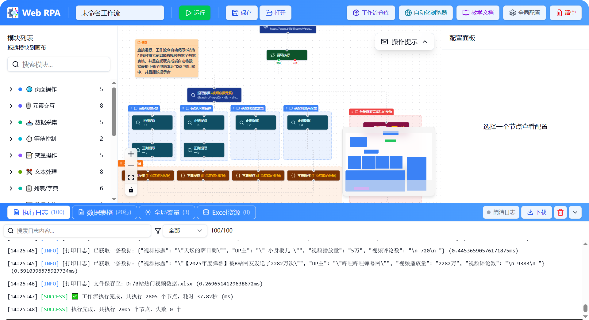
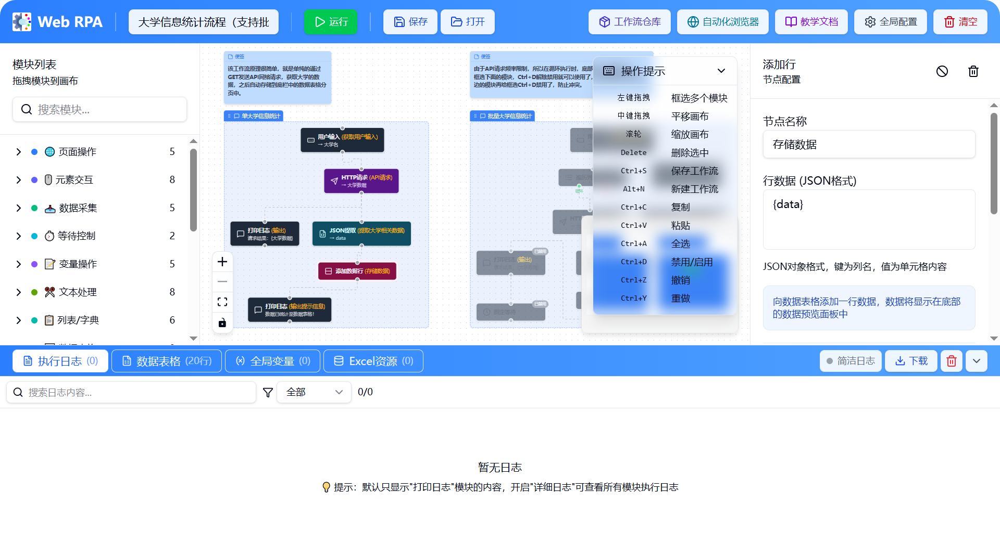
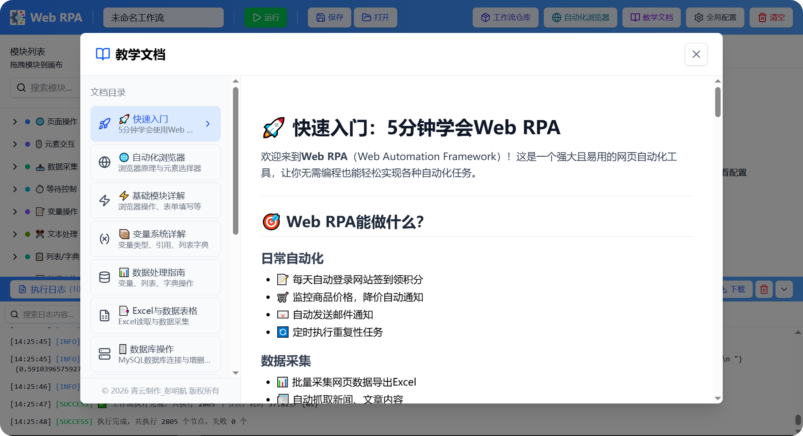
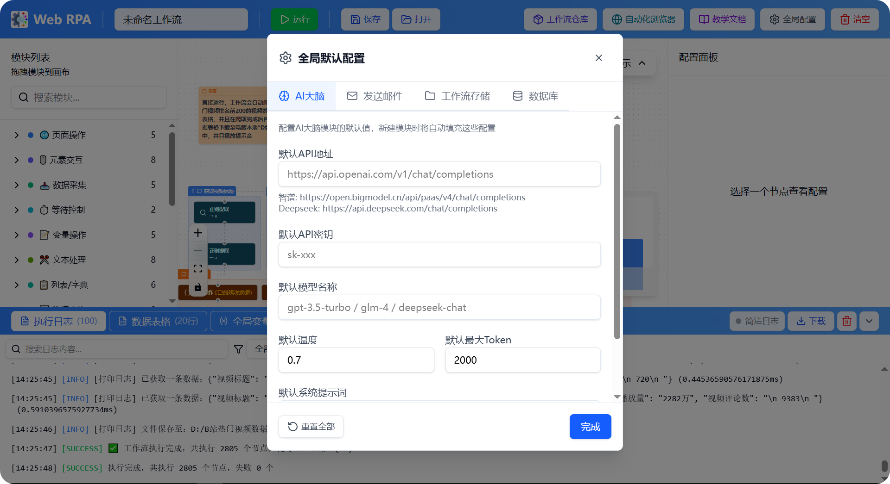
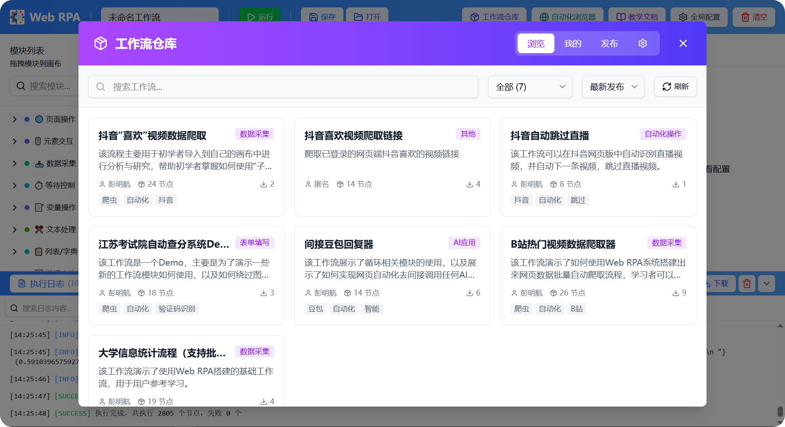
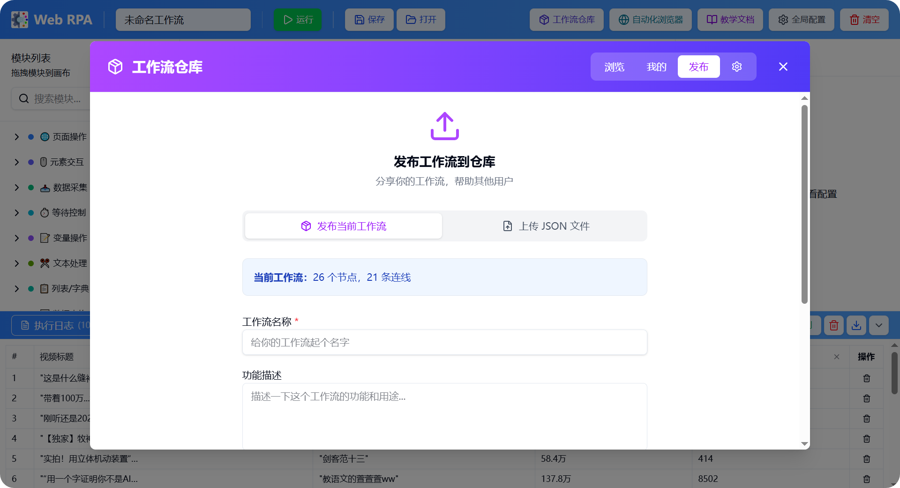

<div align="center">
    
</div>
<h1 align="center">
Web RPA - 网页机器人流程自动化工具
</h1>
<p align="center">
  
  
  
</p>


**一款功能强大的可视化网页自动化工具（支持少量系统桌面自动化），通过拖拽模块的方式快速构建自动化工作流，无需编写代码即可实现网页数据采集、表单填写、自动化测试等任务。**

**【仓库中的源码不会再进行更新了，请直接在Releases中下载最新7z压缩包以获取最新源码】**

---

## ✨ 功能特性

### 🌐 浏览器自动化
- 打开/关闭/刷新/前进/后退网页
- 点击、悬停、输入文本
- 下拉选择、复选框操作
- 拖拽元素、滚动页面
- 处理弹窗对话框
- 可视化元素选择器
- 等待元素出现/消失

### 📥 数据采集
- 提取页面元素数据
- 网页截图/屏幕截图
- 下载文件/保存图片
- 支持相似元素批量采集
- 网络请求抓包

### 📊 数据处理
- 变量管理系统
- JSON 解析
- Base64 编解码
- 正则表达式提取
- 字符串处理（拼接、替换、分割、截取、大小写转换等）
- 列表操作（添加、删除、获取、长度等）
- 字典操作（设置、获取、键列表等）
- 数据表格操作（添加行/列、设置/读取单元格、导出等）
- Excel 读取与导出

### 🗄️ 数据库操作
- MySQL 数据库连接
- 增删改查操作
- 自定义 SQL 执行
- 连接池管理

### 📁 文件操作
- 获取文件列表
- 复制/移动/删除文件
- 创建文件夹
- 文件/文件夹重命名
- 读取/写入文本文件
- 获取文件信息
- 检查文件是否存在

### 🎬 媒体处理
- 格式转换（视频/音频/图片）
- 视频压缩（支持进度显示）
- 图片压缩
- 提取音频
- 视频裁剪
- 媒体合并（支持音视频合并）
- 添加水印
- M3U8视频下载
- 视频旋转/翻转
- 视频倍速播放
- 视频截取帧
- 视频添加字幕
- 音频调节音量
- 视频分辨率调整

### 🔀 流程控制
- 条件判断（支持多种比较运算）
- 循环（次数循环、条件循环）
- 列表遍历
- 跳出/继续循环
- 子流程复用
- 定时任务

### 🤖 AI 能力
- AI 对话（支持 OpenAI、智谱、Deepseek、通义千问等）
- 图像识别/AI视觉
- 人脸识别
- 图片 OCR

### 🔐 验证码处理
- OCR 文字识别验证码
- 滑块验证码自动处理

### 🔔 消息通知与交互
- 打印日志（多级别）
- 播放提示音
- 播放音乐（支持播放器控制）
- 播放视频（支持播放器控制）
- 查看图片（支持缩放/旋转/下载）
- 语音播报（TTS）
- 用户输入弹窗（支持多种输入模式）
- 发送邮件

### 🖥️ 系统操作
- 真实鼠标点击/移动/滚动
- 真实键盘输入
- 模拟按键组合
- 剪贴板读写
- 执行系统命令
- 点击图像（图像识别点击）
- 获取鼠标位置
- 关机/重启/锁屏

### 🛠️ 辅助功能
- 自定义 JavaScript 脚本执行
- HTTP/API 请求
- 随机数生成
- 获取当前时间
- 分组/备注节点
- 智能超时配置（根据模块类型自动设置合理超时）
- 模块搜索支持拼音和首字母

---

## 🖼️ 界面预览

工作流编辑器采用可视化拖拽设计，左侧模块列表，中间画布区域，右侧配置面板，底部日志/数据/变量面板等



---



---



---



---



---



---

## 🚀 快速开始

### 环境要求

- Windows 10/11（本项目仅支持Windows系统使用）
- 项目自带 Python 3.13 和 Node.js（无需额外安装）

### 启动方式

在Releases中下载最新版7z压缩包，之后解压出来，直接双击其中的 `双击启动WebRPA本地服务.bat` 即可快速启动本项目，脚本会自动启动前后端服务并自动运行客户端EXE：

- 后端服务：http://localhost:8000
- 前端服务：http://localhost:5173

### 开发模式

如需修改代码进行开发：

```bash
# 后端
cd backend
../Python313/python.exe -m pip install -r requirements.txt
../Python313/python.exe run.py

# 前端
cd frontend
../nodejs/npm install
../nodejs/npm run dev
```

---

## 📁 项目结构

```
WebRPA/
├── backend/                 # 后端服务 (Python FastAPI)
│   ├── app/
│   │   ├── api/            # API 路由
│   │   ├── executors/      # 模块执行器
│   │   ├── models/         # 数据模型
│   │   └── services/       # 核心服务
│   ├── requirements.txt
│   └── run.py
├── frontend/               # 前端界面 (React + TypeScript)
│   ├── src/
│   │   ├── components/     # UI 组件
│   │   ├── store/          # 状态管理
│   │   └── types/          # 类型定义
│   └── package.json
├── frameworkHub/           # 工作流市场服务 (Node.js)
├── Python313/              # 内置 Python 环境
├── nodejs/                 # 内置 Node.js 环境
├── ffmpeg.exe              # 媒体处理工具
├── ffprobe.exe             # 媒体信息工具
├── workflows/              # 本地工作流存储
└── 双击启动WebRPA本地服务.bat
```

---

## 📖 使用说明

项目内置完整的教学文档，点击工具栏的「教学文档」按钮即可查看。

### 基本操作

1. **创建工作流**：从左侧模块列表拖拽模块到画布
2. **连接模块**：从模块底部拖出连线到下一个模块顶部
3. **配置模块**：点击模块，在右侧面板配置参数
4. **使用变量**：在输入框中使用 `{变量名}` 引用变量
5. **运行工作流**：点击工具栏的运行按钮
6. **查看结果**：在底部面板查看日志、数据、变量

### 文档功能

- 📚 16个分类的详细教学文档
- 🔍 支持全局模糊搜索
- 📝 丰富的代码示例
- 💡 最佳实践指南

---

## 🔧 技术栈

### 前端

- **框架**：React 18 + TypeScript
- **构建工具**：Vite 6
- **UI 组件**：Radix UI + shadcn/ui
- **样式**：TailwindCSS 4
- **流程图**：React Flow
- **状态管理**：Zustand
- **图标**：Lucide React
- **Markdown 渲染**：React Markdown + remark-gfm

### 后端

- **运行时**：Python 3.13
- **Web 框架**：FastAPI + Uvicorn
- **实时通信**：Socket.IO
- **浏览器自动化**：Playwright (Microsoft Edge)
- **数据库连接**：PyMySQL
- **Excel 处理**：openpyxl
- **邮件发送**：smtplib + email
- **AI 集成**：OpenAI API 兼容接口
- **OCR 识别**：ddddocr
- **图像处理**：Pillow
- **媒体处理**：FFmpeg
- **HTTP 客户端**：httpx

### 工作流仓库服务

- **运行时**：Node.js
- **Web 框架**：Express
- **数据存储**：JSON 文件
- **进程管理**：PM2

---

## 📊 模块统计

| 分类 | 模块数量 |
|------|----------|
| 浏览器操作 | 12 |
| 表单操作 | 5 |
| 数据处理 | 9 |
| 字符串操作 | 8 |
| 列表操作 | 3 |
| 字典操作 | 3 |
| 数据表格 | 7 |
| 数据库操作 | 7 |
| 网络请求 | 2 |
| AI能力 | 2 |
| 验证码 | 2 |
| 流程控制 | 7 |
| 辅助工具 | 12 |
| 系统操作 | 11 |
| 文件操作 | 10 |
| 媒体处理 | 14 |
| AI识别 | 2 |
| 分组/备注 | 2 |
| **总计** | **118 个模块** |

---

## 👤 作者

**青云制作_彭明航（一名痴迷于计算机技术无法自拔的大一新生）**

**个人导航站：[https://www.pmhs.top](https://www.pmhs.top)**

---

## 📄 开源协议

本项目采用 [CC BY-NC-SA 4.0](LICENSE) 协议开源。

### 协议要点：

- ✅ **署名**：使用或修改本项目时，必须注明原作者「青云制作_彭明航」
- ❌ **非商业性使用**：不得将本项目用于商业目的
- 🔄 **相同方式共享**：如果您修改或基于本项目二次创作，必须以相同协议开源

**如需商业授权，请联系作者（QQ：2124691573）。**

---

## 🙏 致谢

**感谢以下开源项目：**

- [Playwright](https://playwright.dev/) - 浏览器自动化
- [React Flow](https://reactflow.dev/) - 流程图编辑器
- [FastAPI](https://fastapi.tiangolo.com/) - Web 框架
- [TailwindCSS](https://tailwindcss.com/) - CSS 框架
- [FFmpeg](https://ffmpeg.org/) - 媒体处理
- [Socket.IO](https://socket.io/) - 实时通信

---

## ⭐ Star History

这是我开源的第一款产品，如果这个项目对你有帮助，请点一个 Star ⭐ 支持一下！

<h4 align="center">☕请作者喝杯奶茶☕</h4>

<div align="center">
    
    &nbsp;&nbsp;&nbsp;&nbsp;&nbsp;&nbsp;
    
</div>
